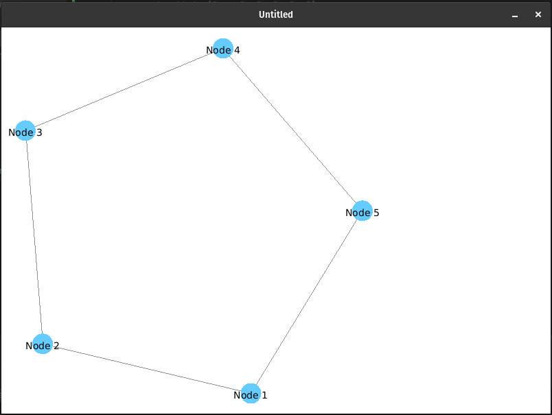

# compose-graphStreamAdapter

This repository contains a simplified version of the adapter used in [mindGraph](https://github.com/olk90/mindGraph).



## Overview

This Kotlin code defines a composable function GraphStreamPanel that integrates a GraphStream graph visualization into a
Jetpack Compose UI. It uses the GraphStream library to render graphs and the Compose SwingPanel to embed the Swing-based
GraphStream view into a Compose application.
Package

```kotlin
package de.olk90.graphStreamAdapter.view
```

This code is part of the de.olk90.graphStreamAdapter.view package.

## Dependencies

The code relies on the following libraries:

* GraphStream 2.0
* Compose Desktop

Ensure these dependencies are properly included in your project.

## Parameters

`graphState`: The same `MutableState<Graph>` passed to `GraphStreamPanel`.

## Functionality

* Creates a `SwingViewer` with the graph from graphState.
* Sets the threading model to `GRAPH_IN_GUI_THREAD`.
* Sets the close frame policy to `EXIT`.
* Enables auto layout for the graph.
* Adds and returns a view named "graphView" using SwingGraphRenderer.